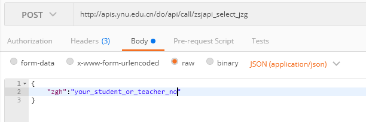

# 能力开放平台

## 快速起步

能力开放平台即ESOP平台，简单来说是一个`api管理的平台`，支持管理从`主数据平台`自动同步过来的接口以及自建的api接口。提供`分类`、`授权`、`统计`，`使用情况统计`等通用的API网关功能。

## 简介

能力开放平台的网址是 http://esop.ynu.edu.cn/ ，如下图所示

其中

- `API中心`，可以看到所有已发布的api接口，详情可参考 [能力开放平台产品功能说明书](./introduction.md)。

    

- `开发者中心`
- 
  - 可以发布API，即添加自建的API，自建的API可以仅实现业务逻辑，在内网可访问即可，不需要授权认证机制，这些功能统一由ESOP平台提供；

    

  - 可以申请使用API，使用API的时候需要在这里通过`新增应用`，然后在应用中`申请API`（可以申请在API中心中可以看到的API），申请审核通过后可以获取`appid`即`token`用于调用API，测试可参考下面的[快速测试](./#快速测试)，详情可参考 [ESOP能力开放平台开发者操作手册](./developer-manual.md)。

    

- `管理员中心`，可以对注册API、使用API、开发者以及系统管理配置进行管理，例如API的分类、标签管理，对自建的API、使用的API进行申请审核、撤销审核，对自建的API的服务器进行管理等，详情可参考 [ESOP 能力开放平台管理员操作手册](./admin-manual.md)。

    

## 快速测试

使用的API无论是自建的，还是从主数据平台自动同步过来的，审核通过后的快速测试可以使用如下方式

需要注意的是使用`JSON`格式（Content-Type:application/json）传递参数，在HTTP请求头中添加上`appId`和`accessToken`。

## 已知的问题或局限性

1. 有时候发布自建的API访问时会出现404或其他错误，过一会就好了。
2. api接口不支持`path variable`，即不支持例如 POST /users/<user_id>/posts/ 这种形式的API，如果URL的path中有参数，需要改写成使用`Query params`的实现，例如 POST /users/posts/?user_id=<user_id>。
3. 主数据那边的接口其实对应的实现直接是`sql`，或者`sql+简单的js封装`，对于复杂的逻辑支持的不好。
