# ESOP 能力开放平台管理员操作手册

## 产品简介

金智教育信息股份有限公司经过多年在校园信息化服务总线的研究和实践的基础上，成功研发了轻量级校园信息化服务总线——能力开放平台(ESOP)，该平台全面解决了高校信息化建设中碎片化服务的注册、申请、监控、鉴权、路由转发等全方位管理的服务框架。

## 产品系统架构

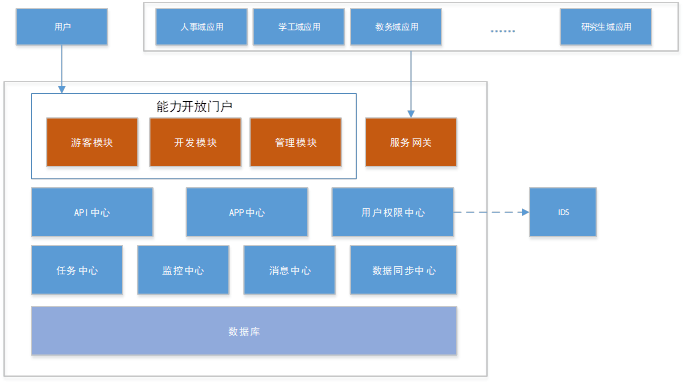

## 关于本手册

ESOP 能力开放平台，旨在为 ESOP 平台管理员和 API 的开发或使用人员提供一个统一的、友好的操作界面，以方便管理员管理和监控服务，开发人员开发或调用服务，提示管理员当前平台面临的问题，帮助管理员对 ESOP 能力开放平台集群实时的监控和维护。

本手册旨在通过界面和操作步骤的说明来指导管理员完成对 ESOP 能力开放平台日常的维护和管理事务。本手册的读者需已经阅读过 ESOP 能力开放平台的产品说明文档，了解 ESOP 能力开放平台的基本功能结构。涉及到的读者包括：

API 接口管理人员，对应 ESOP 能力开放平台的管理员账号。

ESOP 能力开放平台项目实施人员，对应 ESOP 能力开放平台的超级管理员账号（esopadmin）。

## 操作约定

### 主界面样式

ESOP 能力开放平台的主界面如上图所示，涵盖以下几个功能菜单：

首页：首页页面，支持客户化；

API 中心：当前系统中已经支持的 API 列表在线查看，可以按照分类过滤或者支持根据关键字搜索对应的 API 列表，同时对开发者而言还可以查看该 API 的详细信息；

开发者中心：在开发者登录系统后，可以在开发者中心进行 API 的创建和申请使用 API；

管理员中心：管理员可以对开放者注册的 API 以及申请使用的 API 进行审核、关闭、关联服务器等相关操作，还可以管理普通开发者、管理员的用户信息（超管权限），以便对应的接口可以被正常使用；

帮助文档：由管理员将支持和帮助文档，维护到系统中，例如：《平台公约》、《接口开发规范》等。此文档可供开发者和游客等任意查看；

### 基于角色的访问控制

针对 ESOP 能力开放平台安全性、便于管理的要求，ESOP 能力开放平台采用了基于角色的访问控制技术。角色划分和所具有的权限如下：

| 角色                     | 责任描述                                                                                                                | 权限                                                                                                                                                  |
| ------------------------ | ----------------------------------------------------------------------------------------------------------------------- | ----------------------------------------------------------------------------------------------------------------------------------------------------- |
| 超级管理员（esopadmin）  | ESOP 能力开放平台的最高权限管理员账号（唯一），且默认账号为 esopadmin，负责维护管理员权限，任免管理员和管理员的开发权限 | a) 含有开发者和普通管理员的所有角色功能 b) 可以将普通开发者设置为管理员，或者收回管理员的角色                                                         |
| 管理员（普通开发者提权） | 具有管理员权限的普通开发者，有超级管理员授权而来，作为一般情况下 ESOP 能力开放平台的管理者；                            | a) 对开放者注册或申请使用的 API 进行审核操作 b) 对提供的 API 进行服务器的绑定操作 c) 可以将普通开发者设置免审核权限 d) 开发者权限（此权限由超管任免） |
| 开发者                   | 普通账号登录后，即是开发者，可以进项接口注册和申请使用接口，但都需要管理员审核                                          | a) 可以将开发的 API 注册到 ESOP 系统中 b) 可以申请使用现在 ESOP 系统中已经存在的 API 接口                                                             |
| 游客                     | 未登录状态下的角色，可以浏览平台部分信息；                                                                              | a) 查看 ESOP 能力开放平台中已有 api 接口的简略信息 b）查看帮助文档                                                                                    |

## 操作指南

### 登录及退出

#### 登录

ESOP 系统支持统一身份认证登录以及第三方使用邮箱注册账户方式进行登录，用户刚登录时角色为普通开发者角色，可以由系统超级管理员将某个开发者设置为管理员角色

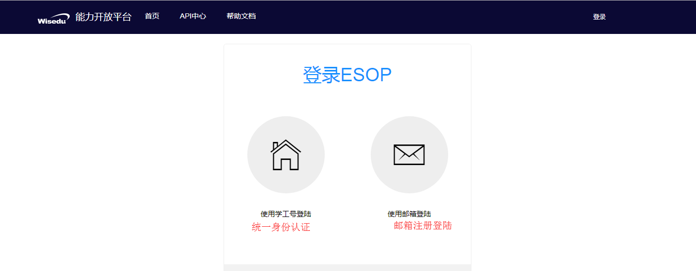

使用校内统一身份认证登陆（ids6、或认证代理层）

点击使用学工号登陆，跳转到统一身份认证页面，输入账号密码点击登陆即可；

外部人员使用邮箱注册登陆

点击使用邮箱登陆，输入注册时使用的邮箱地址、密码、验证码点击登陆即可；

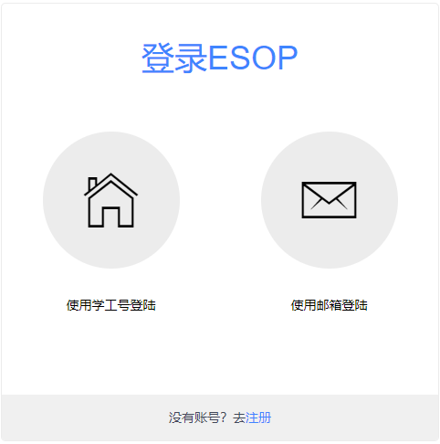

登陆成功后，右上角显示登陆信息：

#### 邮箱账号注册

使用邮箱登陆，需要先进行邮箱账号注册，依次点击

登陆—>使用邮箱登陆—>没有账号?去注册—>填写注册信息—>完成注册

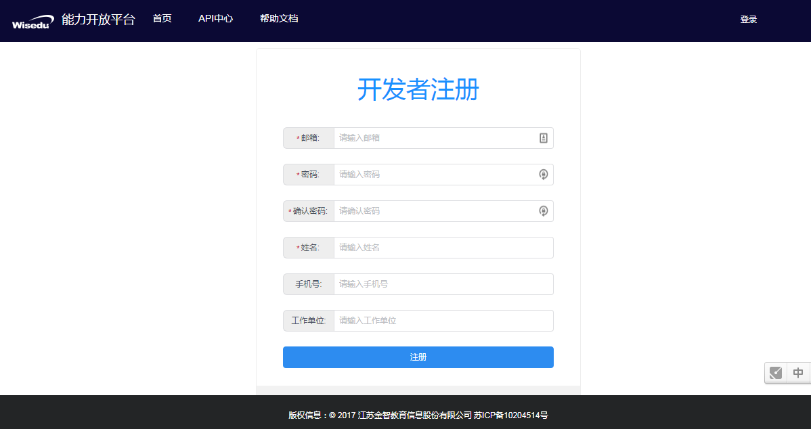

登陆填写的邮箱，查收激活邮件，点击链接激活：

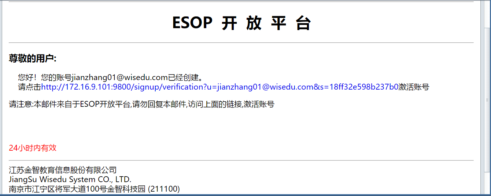

#### 退出

在主界面右上方的已登录人员姓名中点击“倒三角”按钮，再点击退出，退回到登录页面。

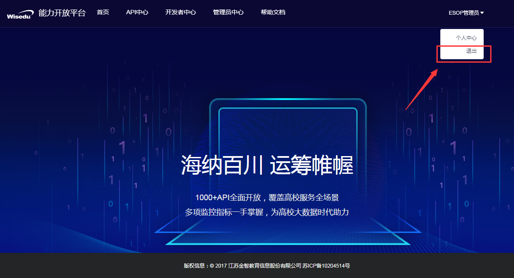

### 系统功能模块

#### API 中心

当前系统中支持的 API 列表可以在线查看。可以按照分类过滤或者支持根据关键字搜索对应的 API 列表，同时对开发者而言还可以查看该 API 的详细信息

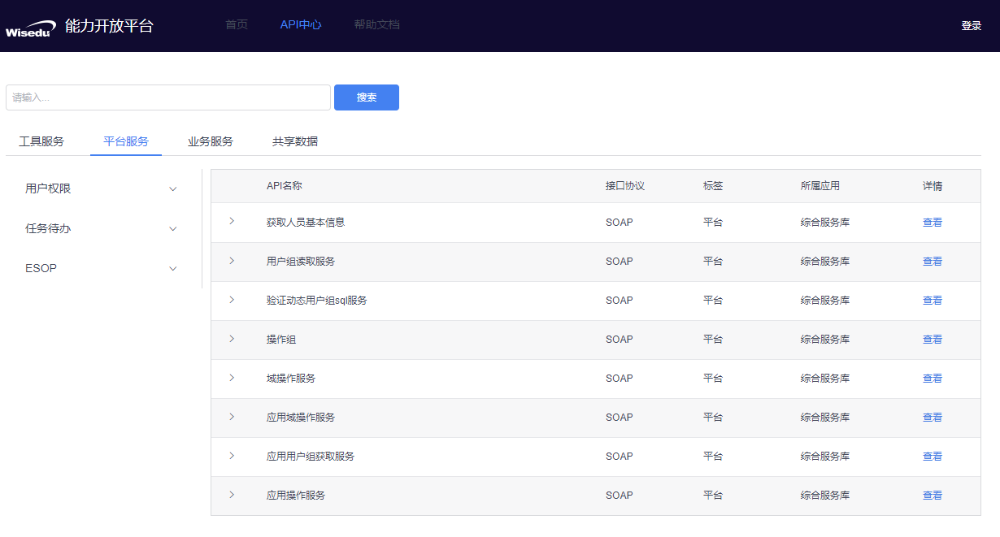

查看某个具体 API 的详细定义信息

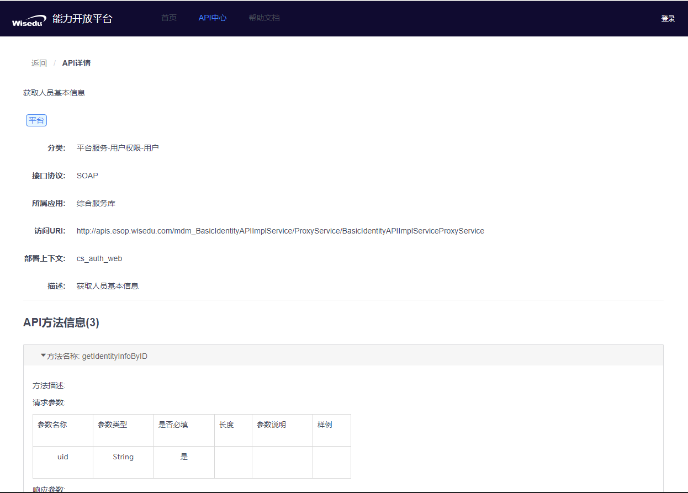

#### 管理员中心

管理员可以对开放者注册的 API 以及申请使用的 API 进行审核、关闭、绑定服务器维护等相关操作，以便对应的接口可以被正常使用

##### 注册 API 管理

###### 注册 API 的审核

依次点击：管理员中心—>注册 API 管理—>注册 API 审核

管理员可以对开发者注册的接口进行审核，只有审核通过的接口才允许被其他应用申请使用

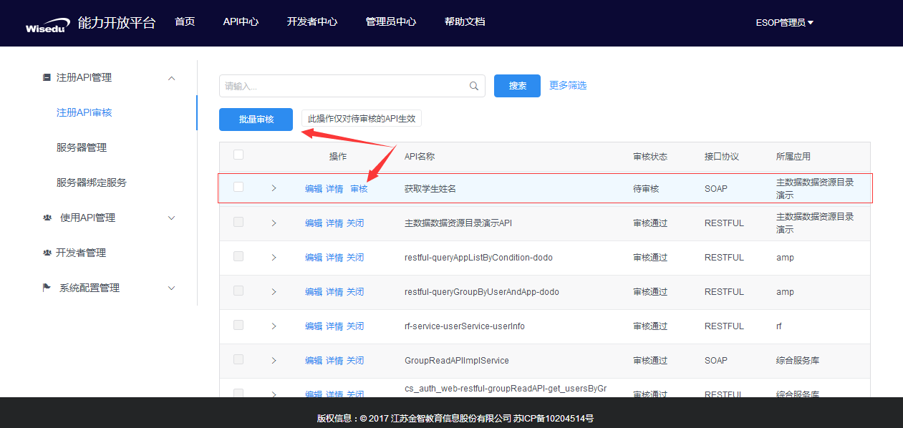

###### 服务器管理

服务器表示提供接口功能的程序，需要添加的服务器地址一般理解为：程序所在服务器的 IP 和程序占用的端口号（如果服务器 IP+端口号被 nginx 代理出去或者做了 DNS 解析，那么该地址是 nginx 或域名）

新增服务器，依次点击：管理员中心—>注册 API 管理—>服务器管理—>新增

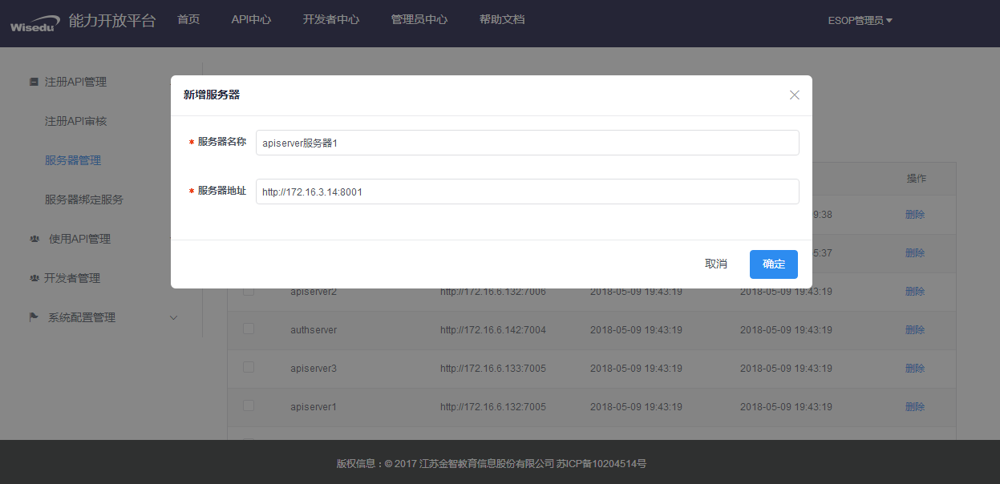

###### 服务器绑定服务

服务器绑定，指将上文中添加的服务器信息，与应用中的上下文做绑定，调用该应用下的 API 时，才能将请求最终转发到提供 API 的服务器的程序上，一个上下文即为一个接口程序；

应用、上下文、服务器地址、api 接口之间的关系如下图所示；

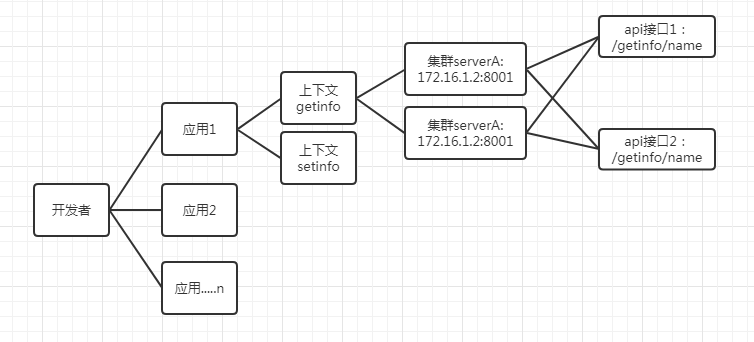

绑定服务器，依次点击：管理员中心—>注册 API 管理—>服务器绑定服务—>选中应用—>选择上下文—>点击绑定

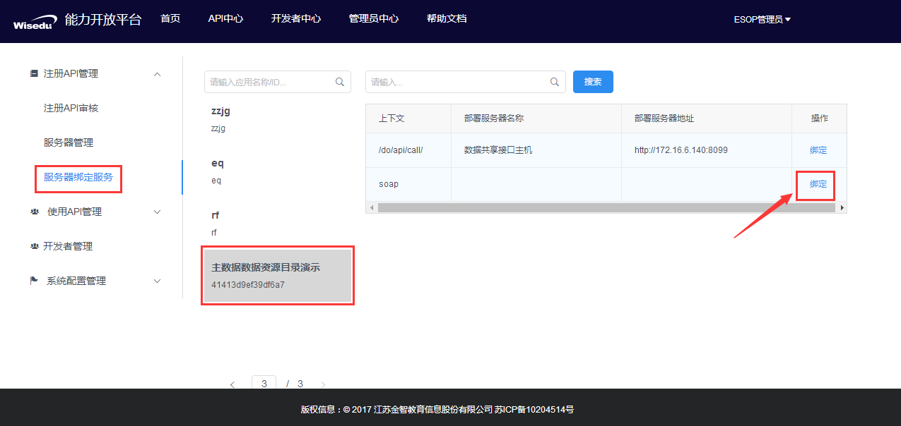

勾选添加的服务器，点击确定即可：

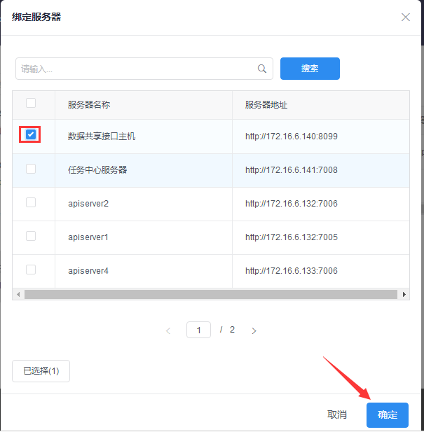

##### 使用 API 管理

管理员可以对开发者申请使用 API 的信息进行管理，包括如下功能：

###### 申请 API 审核

管理员可以对开发者申请使用的 API 进行审核，审核通过后系统给应用生成 token 编码，对应该应用下的“accessToken”参数，作为调用接口的鉴权信息之一；

待审核列表:

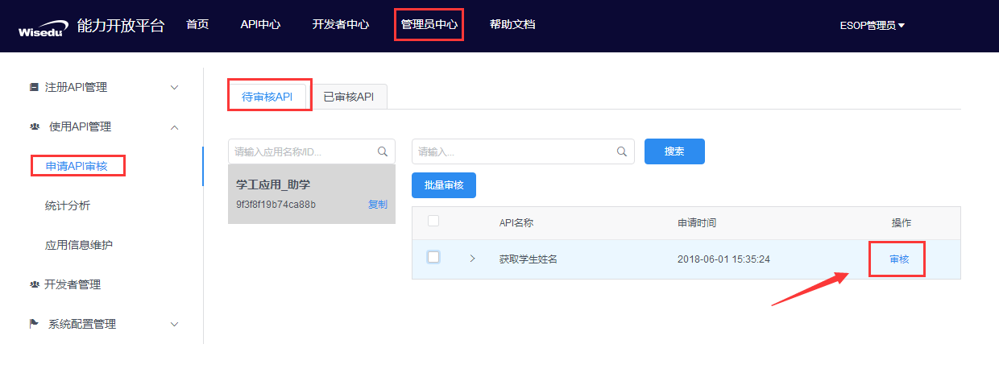

查看已审核列表

已审核列表中，可以看到当前 esop 平台中所有应用下，申请使用的所有接口；

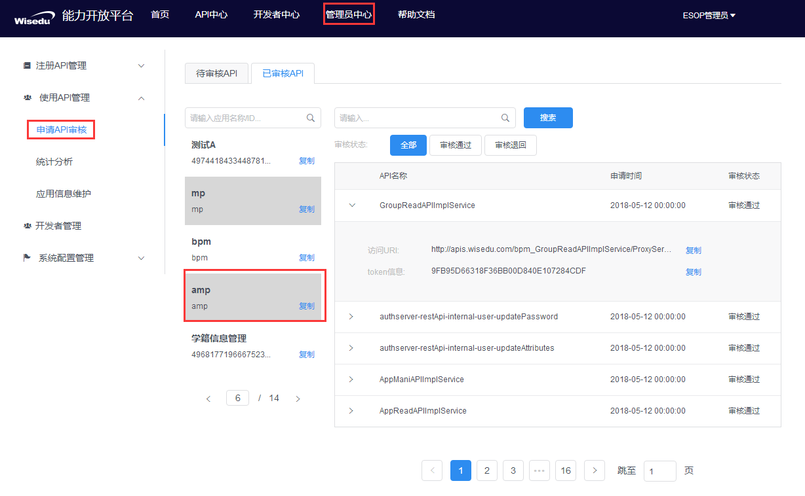

###### 统计分析

管理员可以查看系统中的各个接口被应用的调用情况，并且进行汇总调用总次数，成功、失败次数，并且按照各个应用进行分别统计，以及查看某个接口调用的请求 IP，调用时长等相关信息，以便管理员对接口调用有一个清晰的认知，有益于接口调用统计与问题排查；

api 调用次数 Top10 柱状统计图

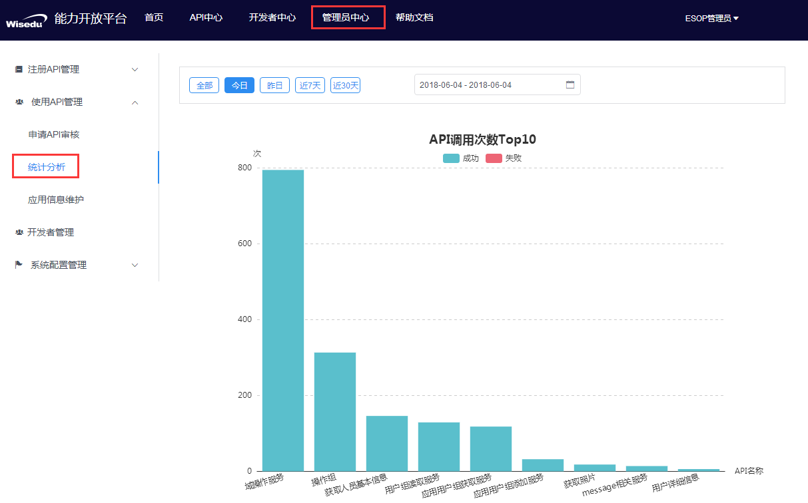

###### 应用信息维护

为防止后续应用升级但对应开发者调整的而无法申请新接口的问题，管理员可以对应用增加其他开发可以对应用进行维护

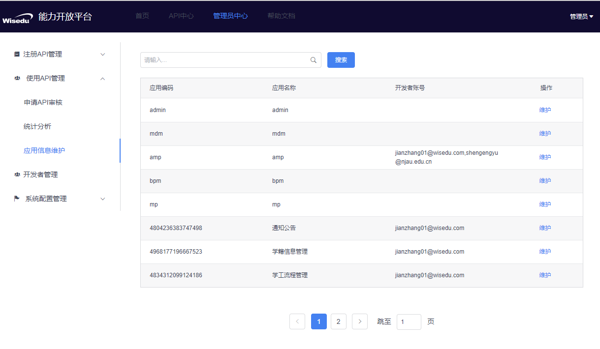

##### 开发者管理

管理员可对系统中的开发者进行管理，可以设置开发者的免审核权限，同时如果是校外用户（使用邮箱账户登录的用户），管理员可以对其进行删除

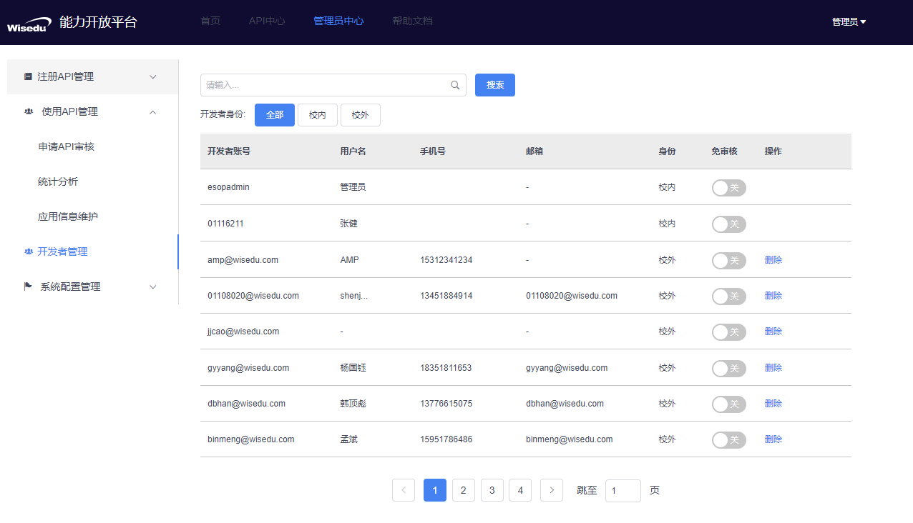

##### 系统配置管理

系统在实际运行过程中需要各自分类、标签、文档、系统邮件模板调整、学校信息查看等相关功能配置

###### 系统分类管理

API 中心可以根据分类展示对应的 API 列表，学校如果想增加分类，可以由管理员在系统分类管理中维护

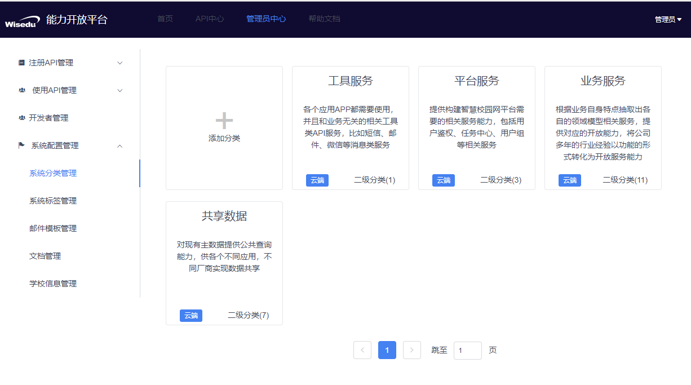

###### 系统标签管理

API 中还有一个属性为标签，用于标识一个 API 的子分类，支持根据关键字搜索，管理员可以标签进行维护

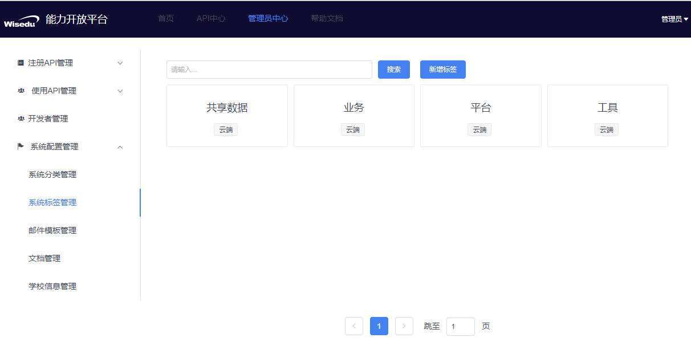

###### 邮件模板管理

但用户注册完成、忘记密码、支持三级等保时的动态验证码时都需要系统发送一份邮件，由于邮件中主题、正文内容在每个学校可能都不相同，因此支持学校进行调整。

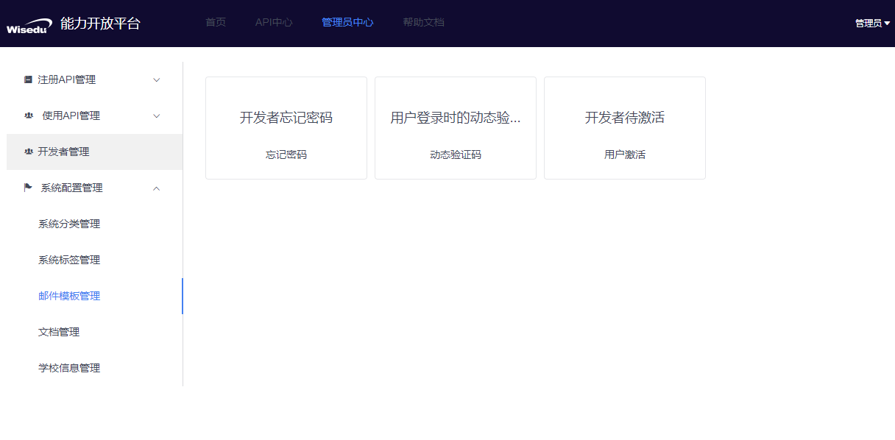

###### 文档管理

游客可以在帮助文档中看到系统约定、开发指导、系统操作指南，这些内容每个学校是不同的，因此支持学校管理员手工添加对应的文档内容

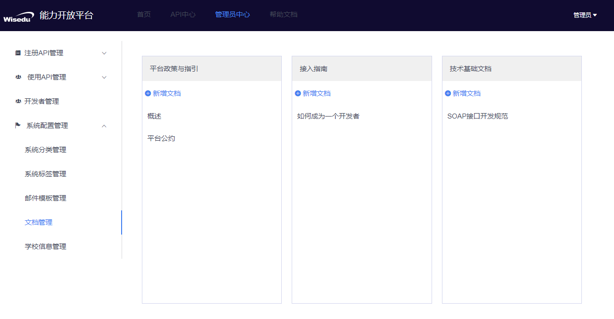

###### 学校信息管理

在系统中需要查看当前系统的版本号，网关地址，升级的时间等相关信息，同时支持修改，以及手工将校端生成的数据同步给云端

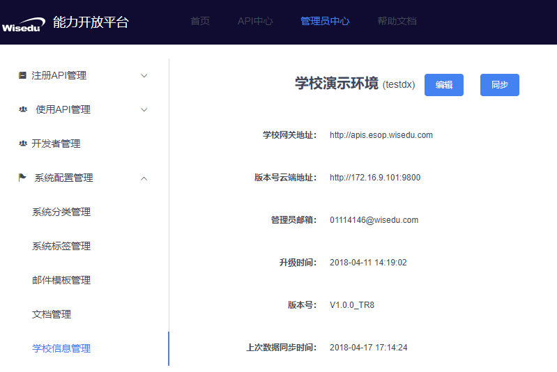
