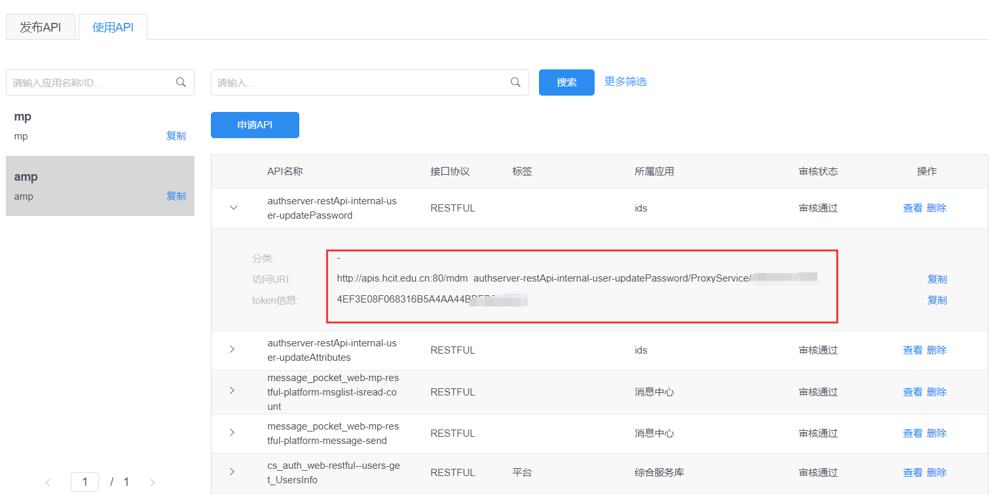
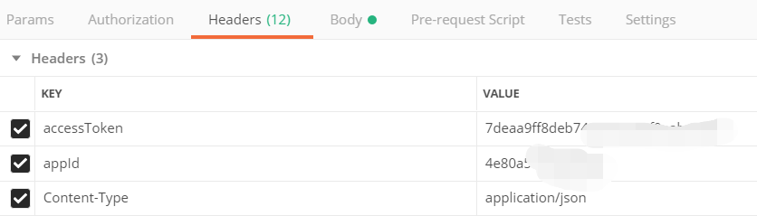
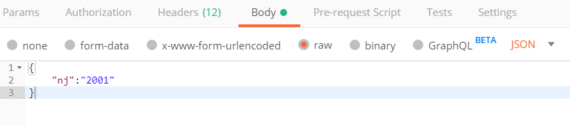
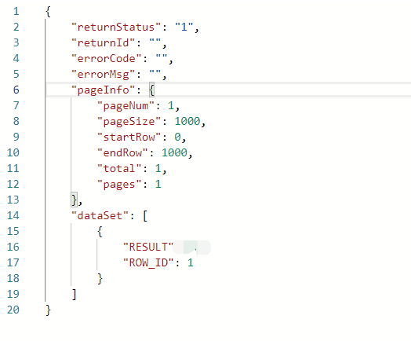

# API 用法

在 《ESOP 能力开放平台开发者操作手册》中提到如何申请使用 API：新增应用时的应用编码即为应用接口时的"appId"；获得使用权之后，即可看到接口对应的访问 URL 和 token 信息。如图

查询对应的接口文档，以此得知接口的信息。发送的请求数据中：Headers 中要包含 accToken，appid，Centent-Type，同时 body 里面应该带至少一个有请求参数。以正确的方式发送完整的请求，即可获得正确结果。

例如：研究生统计数量 API 的使用

查询此 api 得到此 api 是用过 post 方式请求，以及 url，如下图所示：

Header 中要包含 accToken,appid,Centent-Type，如下图所示

body 中要至少包含一个请求参数（在研究生统计数量 API 中可看到请求参数），如下图所示：

发送请求之后得到的结果，如下图所示：

