# ESOP能力开放平台开发者操作手册 

## 开发者账号登陆

如果开发者角色为校方开发者，点击“使用学工号登陆”按钮，跳转到IDS页面进行登陆:

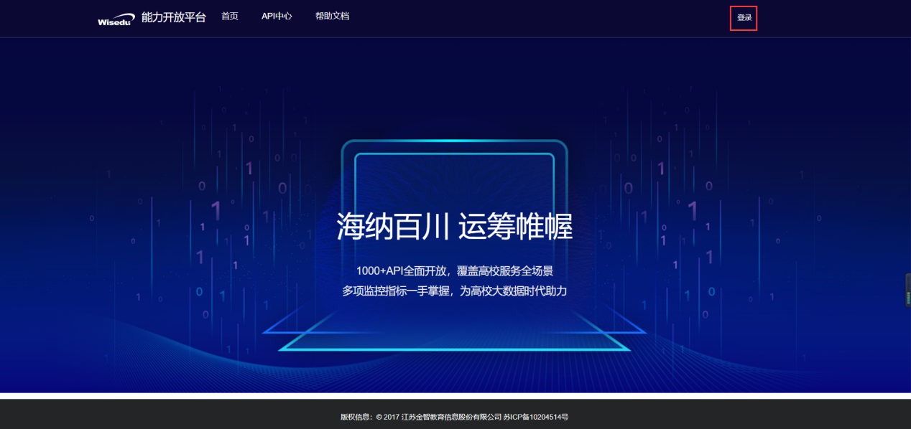

### 校内开发者

如果开发者角色为校方开发者，点击“使用学工号登陆”按钮，跳转到IDS页面进行登陆:

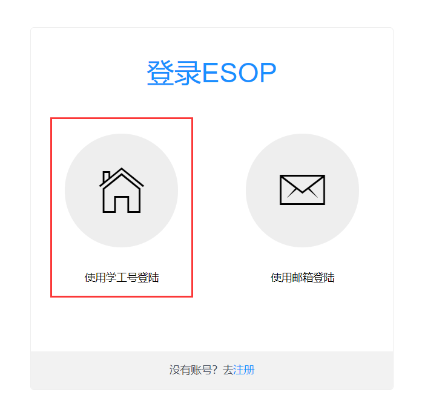

### 校外开发者

如果开发者角色为校外开发者，点击“注册”按钮，进行注册操作：

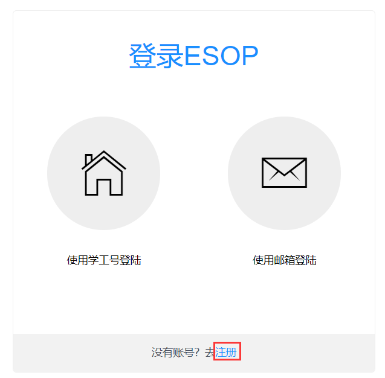

弹出注册页面后，请输入相关信息完成注册操作：

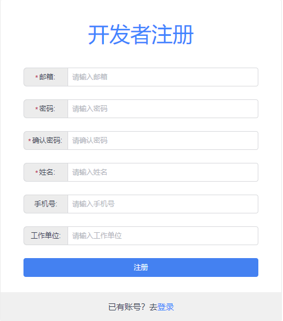

注册完毕后，系统会向注册的邮箱发送一封激活邮件，开发者点击该激活邮件，则账户激活成功，回到登陆页面，点击“使用邮箱登陆”按钮，输入相关信息完成登陆操作。

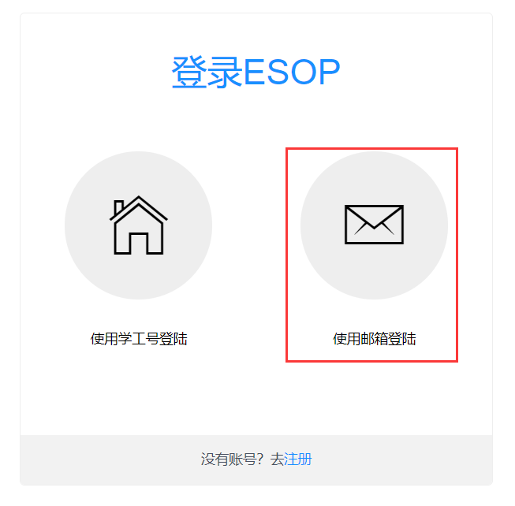

## 发布API

开发者登陆后依次点击：开发者中心—>发布API—>新增—>填写接口信息，如图实例，填写红色标星的必填项：

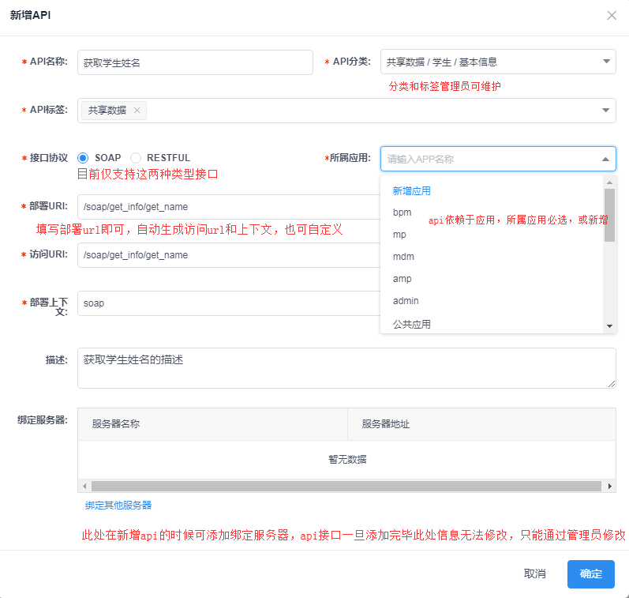

最后点击确定即可完成api注册；
注册完毕的状态为待审核状态，如图所示，需要管理员角色进行api接口注册审核（下图是系统管理员操作页面）。

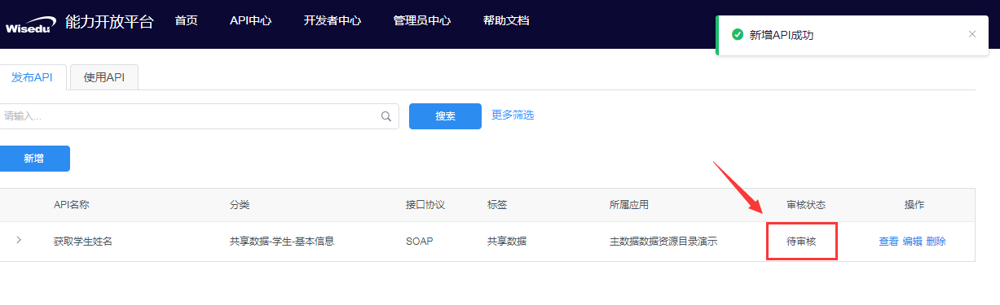

管理员审核通过后，开发者可在“发布API菜单中”查看已经发布的API列表：

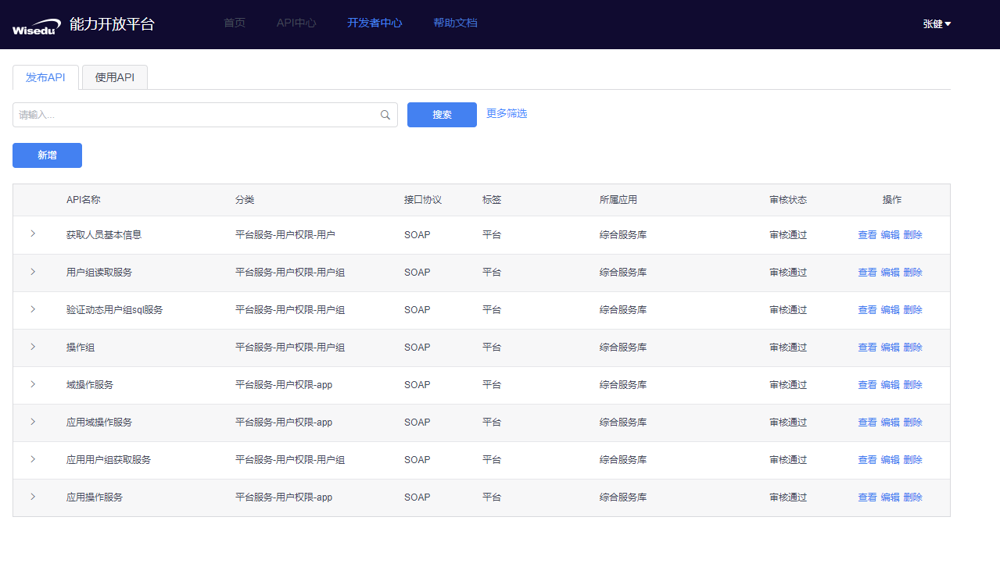

## 维护已发布的API

### 修改API基本信息

在“发布API”菜单可通过筛选，找到自己需要维护的api。
筛选支持API名称、部署URL、访问URL查找：
点击查看可看到API详情：

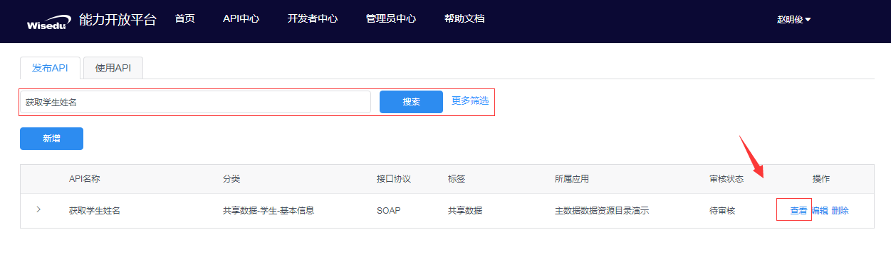

点击“编辑”按钮或者在“查看”菜单中的api详情页面点击“编辑模式”按钮，进入api编辑模式，修改api信息：

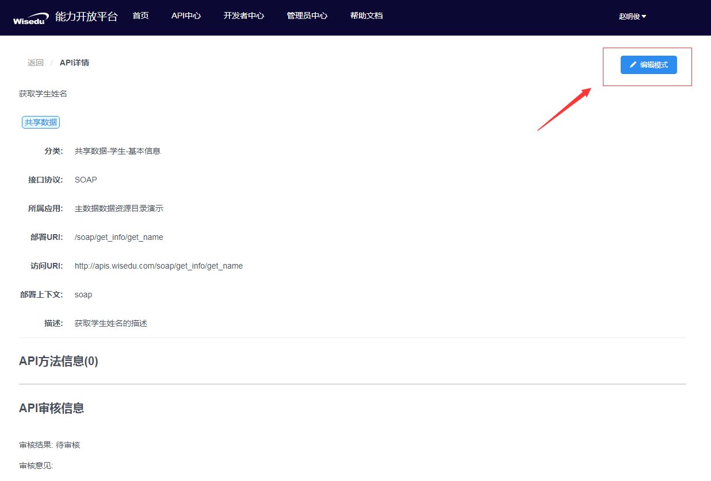

在api编辑模式下修改接口信息：

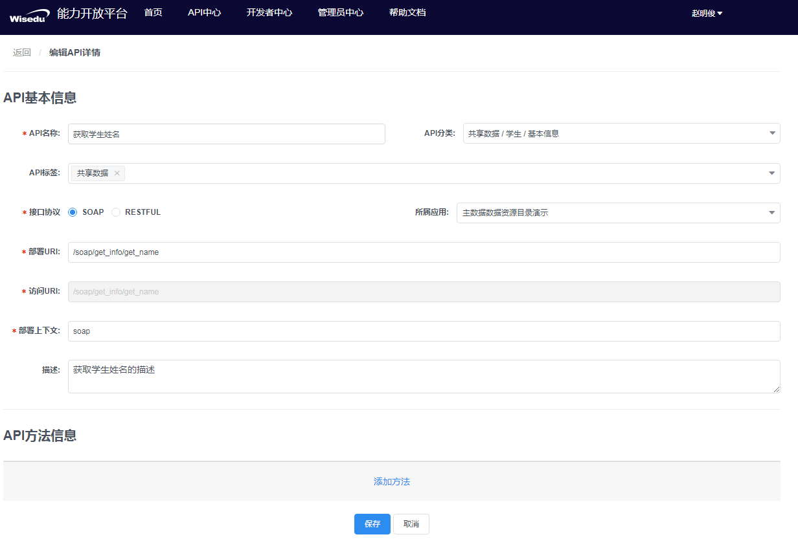

（注：api编辑模式下无法修改服务器信息和服务器绑定信息，此操作只能在新增api时初始化，或者联系管理员在管理员中心做维护操作）

### API方法信息维护

ESOP无法自动解析方法参数，需要接口开发者手动将这些信息维护进去。维护API方法信息的目的是使后期调用该api接口的开发者，能够简洁明了的查询该接口的作用以及调用方法。
在编辑界面中点击“添加方法”，编辑方法名称、方法描述、请求参数等信息，保存即可：

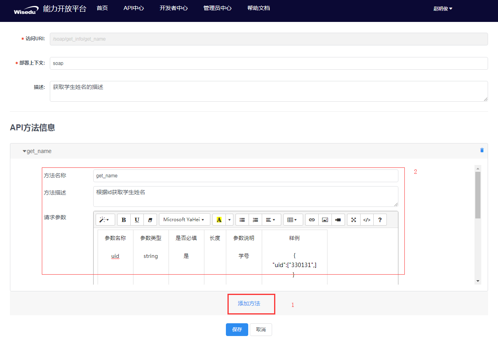

## 申请使用API

### 新增应用

依次点击：开发者中心—>使用API—>新增—>左侧下方点击新增应用：

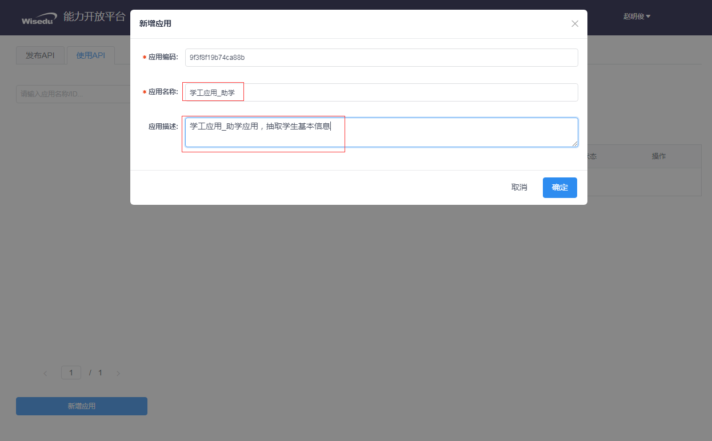

（注：应用编码会随机生成，也可自行定义，应用编码对应该应用下接口的“appId”参数，作为调用接口的鉴权信息之一；）

### 申请API

选择创建的应用—>点击申请API—>筛选需要使用的api接口并勾选—>点击确定提交申请

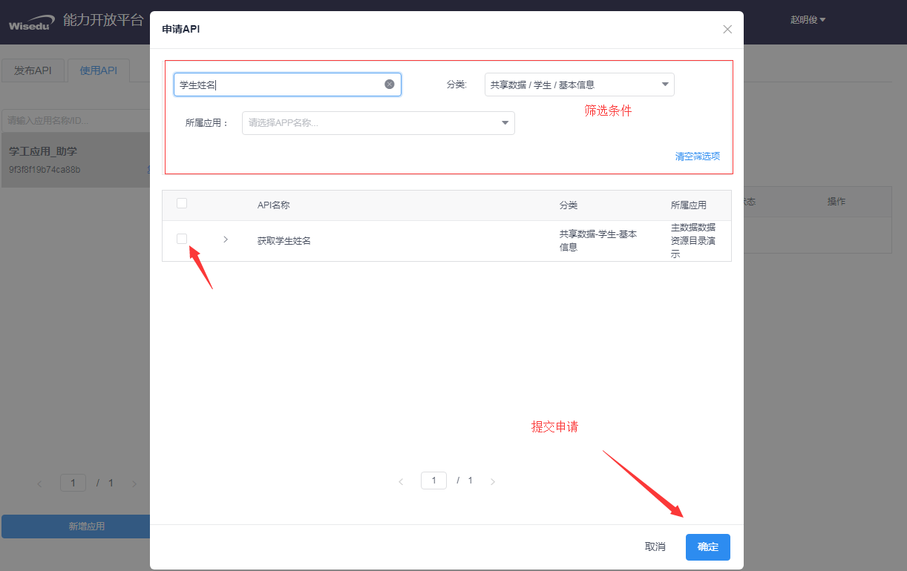

申请后该接口为待审核状态, 如图所示，需要管理员角色进行api接口申请审核（下图是系统管理员操作页面）:

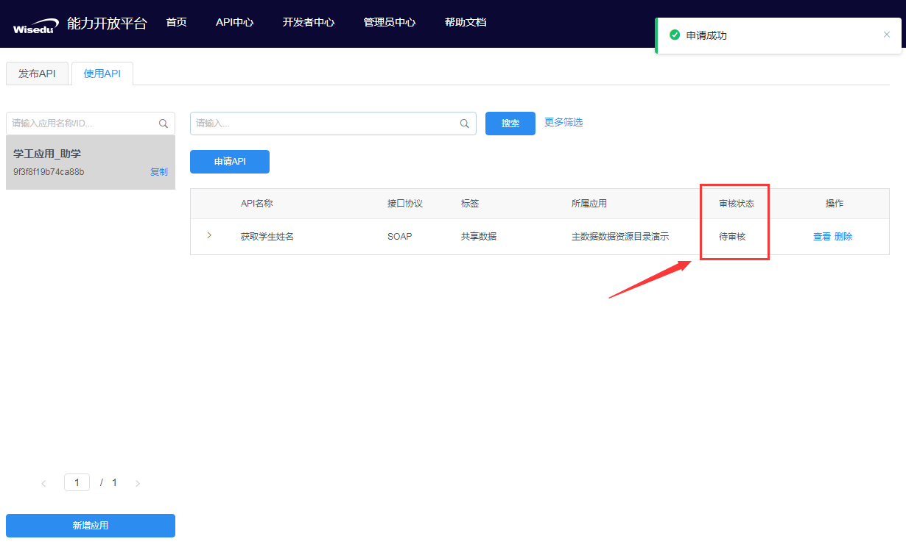

审核通过后，开发者在“使用API”菜单中，对应的应用下，能够看到具体的接口，展开接口信息后，能够看到接口对应的访问URL和token信息。

