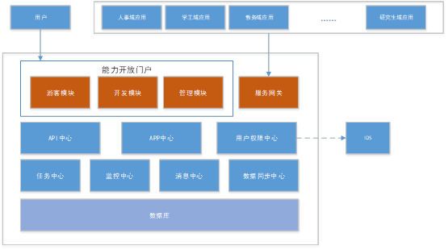

# 能力开放平台产品功能说明书

## 产品背景

信息化校园建设从网络基础建设和部分孤立应用系统的构建，逐渐向集成的全局信息系统建设方向转变，解决了业务系统建设带来的信息安全威胁、信息孤岛和管理责权不清等难题。
随着高校 IT 应用的迅速发展，应用存在能力的重复建设以及应用与应用之间大量交互，导致系统组网越来越复杂，单个应用系统越来越庞大，系统维护与后续版本迭代越来越复杂。

## 产品简介

金智教育信息股份有限公司经过多年在校园信息化服务总线的研究和实践的基础上，成功研发了轻量级校园信息化服务总线——能力开放平台(ESOP)，该平台全面解决了高校信息化建设中碎片化服务的注册、申请、监控、鉴权、路由转发等全方位管理的服务框架

## 产品系统架构

## 产品特点

### 平台特性

#### 平台无关性

能力开放平台 ESOP 完全基于 J2EE 技术开发，具有平台无关性的特点。

#### 标准化

只要满足国际上规范的 SOAP 和 RESTFUL 接口协议的接口都可以注册到 ESOP 平台中，ESOP 平台都可以统一进行授权、监控、路由转发

#### 简单易用性

提供友好易用的界面，更符合高校用户的操作习惯。
提供统一身份认证以及第三方注册两种模式下用户登录，方便高校师生和第三方用户进行系统登录

#### 全面接口运行监控

提供管理员查看所有接口的调用统计，监控所有请求的 IP 地址、请求参数、响应参数等详细信息，可以对 API 接口进行全方位的监控。

#### 应用快速部署

对于金智提供的应用，不在需要关心应用是否底层调用了 API 接口，只需要关注应用本身是否已经接入学校就可以完成应用的部署和使用。

#### 开放性

ESOP 能力开放平台支撑学生、老师、第三方厂商将开发的符合 SOAP 和 RESTFUL 规范的接口注册到平台中，平台就可以对其进行统一的授权、监控，实现将高校所有系统整合为一个整体化的运营平台，不断丰富其应用和实践。

### 功能特点

产品提供统一的 API 门户展示，将系统中开放的所有 API 都统一展示，方便所有用户及时查询对应的 API 的方法参数

产品提供统一的文档功能，方便老师、学生、第三方厂商快速开发 API、使用 API

产品提供统一身份认证以及第三方邮箱注册两种认证方式，并支持管理员设置对应的用户权限，做到了用户权限的精细化控制

产品提供开发者注册 API 并申请使用 API 的功能，方便老师、学生、第三方厂商快速注册和申请使用 API

产品提供管理员对注册的 API 和申请使用的 API 审核操作

产品提供管理员监控各个应用调用 API 的明细数据，并且展示对应的统计列表

管理员可以对系统中使用到的分类、标签、模板、文档、学校信息的维护

产品提供统一网关功能，实现动态路由、断路隔离、负载均衡、详细接口调用日志、接口调用统计分析的相关功能

### 与前一代产品的比较

#### 产品核心框架

基于开源成熟框架 SpringBoot、SpringCloud 进行开发，抛弃原有强依赖 OSB、Redis、Nginx、Lua 等第三方厚重平台和框架，采用纯 java 实现。

#### 游客中心模块

功能主要包括如下内容：

##### 在线文档化

###### 接口文档化

所有接口都支持按照分类展示以及根据关键字查询，可以查看每个接口定义的详细信息，包括方法名称、方法的请求参数和响应参数格式。

###### 帮助文档化

系统中可以查看如何快速开发接口、申请使用接口、注册接口的相关规范文档，指导开发者快速基于能力开放平台提供的能力开发应用

#### 开发者管理

系统支持基于统一身份认证 IDS 的用户登录，以及第三方在门户网站上注册登录两种模式
系统账户分三种角色：

##### 超级管理员

含有开发者和普通管理员的所有角色功能

可以将普通开发者设置为管理员，或者收回管理员的角色

##### 普通管理员

对开放者注册或申请使用的 API 进行审核操作

对提供的 API 进行服务器的绑定操作

可以将普通开发者设置免审核权限

##### 开发者

可以将开发的 API 注册到 ESOP 系统中
可以申请使用现在 ESOP 系统中已经存在

#### 网关功能

支持路由动态负载、断路隔离、负载均衡策略，并且实现接口调用的实时监控，包括监控调用 IP、请求码流、响应码流、分发路由地址、可视化统计显示接口调用的频繁程度

#### 部署

只需要操作系统中安装 JDK1.7 以上版本，ESOP 就可以正常使用。
ESOP 支持 Oracle、MySql 两种数据库

## 产品功能介绍

### 游客模块

#### API 中心

当前系统中支持的 API 列表可以在线查看。可以按照分类过滤或者支持根据关键字搜索对应的 API 列表，同时对开发者而言还可以查看该 API 的详细信息

查看某个具体 API 的详细定义信息

#### 帮助文档

该模块提供开发者一个开发接口和申请使用接口的规范文档，同时指导开发者如何使用 ESOP 平台，平台的相关法律条款等相关内容

### 用户中心

ESOP 系统支持统一身份认证登录以及第三方使用邮箱注册账户方式进行登录，用户刚登录时角色为普通开发者角色，可以由系统超级管理员将某个开发者设置为管理员角色

#### 开发者注册

第三方公司的开发者可以使用邮箱账户在 ESOP 中注册，注册后该开发者将收到一封待激活的邮件，开发者点击该激活邮件后，该账户将被激活成功

激活的邮件如下：

#### 用户登录

ESOP 系统支持两种方式的用户登录

##### 学工号登录

如何有统一身份认证系统 IDS，并且在统一身份认证中设置了对应的 ESOP 访问权限后，该开发者就可以使用学工号进行登录

##### 邮箱登录

如果是第三方公司的开发者，可以使用邮箱账户直接登录 ESOP 系统

#### 用户角色

ESOP 系统中用户分开发者、管理员、超级管理员 三个角色

##### 超级管理员

含有开发者和普通管理员的所有角色功能

可以将普通开发者设置为管理员，或者收回管理员的角色

##### 管理员

对开放者注册或申请使用的 API 进行审核操作

对提供的 API 进行服务器的绑定操作

可以将普通开发者设置免审核权限

##### 开发者

可以将开发的 API 注册到 ESOP 系统中

可以申请使用现在 ESOP 系统中已经存在的 API 接口

### 开发者中心

在开发者登录系统后，可以在开发者中心进行 API 的创建和申请使用 API

#### 发布 API

开发者可以将其开发的 API 接口注册到系统中，同时可以查看当前已经注册的所有 API 列表

查看已经注册的 API 列表

发布 API，填写 API 名称、选择分类、所属应用、部署 URI 地址后即可发布一个 API 接口

#### 申请使用 API

开发者在开发应用时如果需要使用 API 接口，可以在 ESOP 系统中进行申请。操作步骤为先创建一个应用，然后在这个应用中申请需要的 API 接口

新增应用：

选择需要的 API 接口

### 管理员中心

管理员可以对开放者注册的 API 以及申请使用的 API 进行审核、关闭等相关操作，以便对应的接口可以被正常使用

#### 注册 API 管理

##### 注册 API 的审核

管理员可以对开发者注册的接口进行审核，只有审核通过的接口才允许被其他应用申请使用

##### 服务器管理

接口只有在一个特定的服务器上才能正常被运行，因此服务器管理就是维护当前学校所有服务器列表

##### 服务器绑定服务

提供 API 接口的应用需要与服务器关联才能在 ESOP 网关系统中访问到对应的接口

#### 使用 API 管理

管理员可以对开发者申请使用 API 的信息进行管理，包括如下功能：

##### 申请 API 审核

管理员可以对开发者申请使用的 API 进行审核，审核通过后系统给该应用分配一个 Token，用于后续接口调用时的授权码

待审核列表

已审核列表

##### 统计分析

管理员可以查看系统中的各个接口被应用的调用情况，并且进行汇总调用总次数，成功、失败次数，并且按照各个应用进行分别统计，以及查看某个接口调用的请求 IP，调用时长等相关信息

##### 应用信息维护

为防止后续应用升级但对应开发者调整的而无法申请新接口的问题，管理员可以对应用增加其他开发可以对应用进行维护

#### 开发者管理

管理员可对系统中的开发者进行管理，可以设置开发者的免审核权限，同时如果是校外用户（使用邮箱账户登录的用户），管理员可以对其进行删除

#### 系统配置管理

系统在实际运行过程中需要各自分类、标签、文档、系统邮件模板调整、学校信息查看等相关功能配置

##### 系统分类管理

API 中心可以根据分类展示对应的 API 列表，学校如果想增加分类，可以由管理员在系统分类管理中维护

##### 系统标签管理

API 中还有一个属性为标签，用于标识一个 API 的子分类，支持根据关键字搜索，管理员可以标签进行维护

##### 邮件模板管理

但用户注册完成、忘记密码、支持三级等保时的动态验证码时都需要系统发送一份邮件，由于邮件中主题、正文内容在每个学校可能都不相同，因此支持学校进行调整。

##### 文档管理

游客可以在帮助文档中看到系统约定、开发指导、系统操作指南，这些内容每个学校是不同的，因此支持学校管理员手工添加对应的文档内容

##### 学校信息管理

在系统中需要查看当前系统的版本号，网关地址，升级的时间等相关信息，同时支持修改，以及手工将校端生成的数据同步给云端

### 服务网关

支持路由动态负载、断路隔离、负载均衡策略，并且实现接口调用的实时监控，包括监控调用 IP、请求码流、响应码流、分发路由地址、可视化统计显示接口调用的频繁程度

支持打印详细报文日志，追踪应用 APP 调用 API 接口的消息流程，方便消息跟踪问题定位

## 运行环境

### 能力开放门户环境要求

能力开放门户环境要求如下表：

| 内容       | 说明                             |
| ---------- | -------------------------------- |
| 数据库支持 | MYSQL 5.7、Oracle 11g、Oracle12c |
| JAVA 环境  | JDK 1.7 以上版本                 |
| 内存       | 2G 以上                          |
| 硬盘       | 40G 以上                         |

### 服务网关环境要求

服务网关环境要求如下表：

| 内容       | 说明                             |
| ---------- | -------------------------------- |
| 数据库支持 | MYSQL 5.7、Oracle 11g、Oracle12c |
| JAVA 环境  | JDK 1.7 以上版本                 |
| 内存       | 2G 以上                          |
| 硬盘       | 40G 以上                         |
